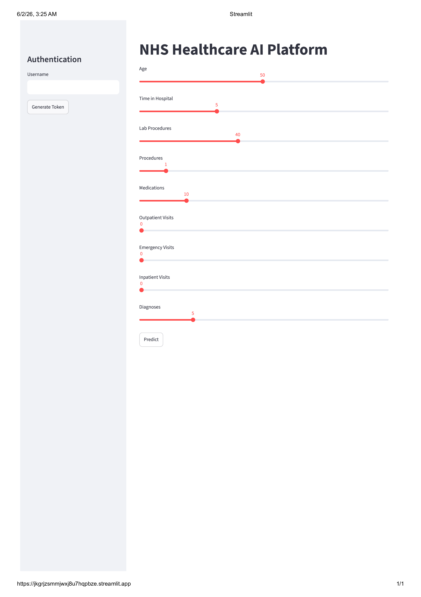
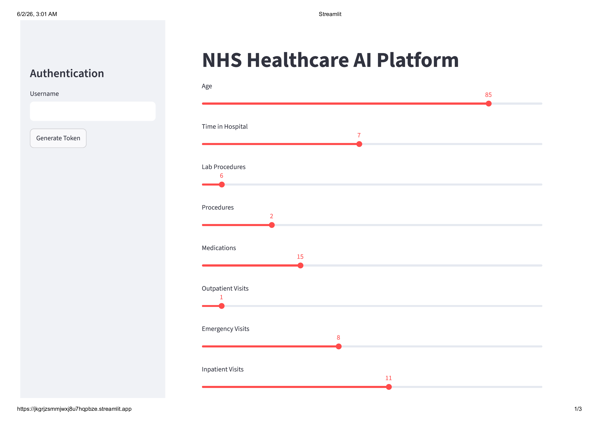
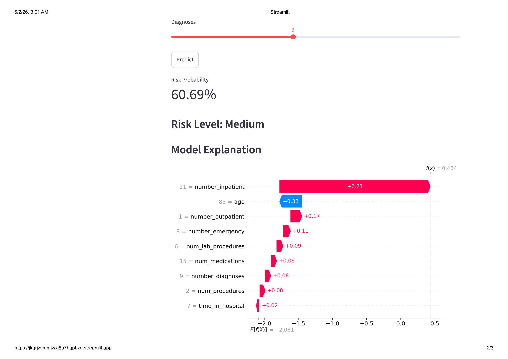

# 🏥 NHS Paediatric Risk Intelligence Platform

## Healthcare AI | Risk Stratification | Explainable Machine Learning | MLOps

A production-style healthcare analytics platform that predicts paediatric patient readmission risk using machine learning and delivers actionable insights through an interactive web application, REST API, explainable AI dashboards, and operational intelligence reporting.

This project was designed to demonstrate the end-to-end skills expected of a Senior Data Scientist within NHS and healthcare environments, including advanced analytics, machine learning, MLOps, cloud deployment, responsible AI, and stakeholder-focused reporting.

---

# 🚀 Live Demo

### Frontend Application

https://jkgrjzsmmjwxj8u7hqpbze.streamlit.app/

### Backend API Documentation

https://nhs-paediatric-risk-intelligence-platform.onrender.com/docs

### API Health Endpoint

https://nhs-paediatric-risk-intelligence-platform.onrender.com

---

# 📸 Screenshots

## Frontend Application

```markdown

```

---

## Prediction Results

```markdown

```

---

## SHAP Explainability Dashboard

```markdown

```

---

## Power BI Executive Dashboard

```markdown


```

---

## FastAPI Swagger Documentation

```markdown

```

---

# 🎯 Business Problem

Hospital readmissions create significant operational pressure and financial cost across healthcare systems.

Identifying patients at high risk of readmission enables healthcare providers to:

* Improve patient outcomes
* Prioritize clinical interventions
* Optimize hospital resources
* Reduce avoidable readmissions
* Support evidence-based decision making

This platform predicts patient readmission risk and provides explainable insights to support healthcare professionals.

---

# 🏗️ Solution Architecture

```text
                    ┌────────────────────┐
                    │  Patient Dataset   │
                    └──────────┬─────────┘
                               │
                               ▼
                  ┌────────────────────────┐
                  │ Data Cleaning & ETL    │
                  │ Pandas / PySpark       │
                  └──────────┬─────────────┘
                             │
                             ▼
                  ┌────────────────────────┐
                  │ Feature Engineering    │
                  └──────────┬─────────────┘
                             │
                             ▼
                  ┌────────────────────────┐
                  │ XGBoost Risk Model     │
                  └──────────┬─────────────┘
                             │
          ┌──────────────────┼──────────────────┐
          ▼                  ▼                  ▼

 ┌─────────────┐   ┌────────────────┐   ┌──────────────┐
 │ FastAPI API │   │ SHAP Analysis  │   │ MLflow       │
 └──────┬──────┘   └────────────────┘   └──────────────┘
        │
        ▼
 ┌─────────────┐
 │ Streamlit   │
 │ Dashboard   │
 └──────┬──────┘
        │
        ▼
 ┌─────────────┐
 │ End Users   │
 └─────────────┘
```

---

# 📊 Dataset

Dataset used:

**Diabetes 130-US hospitals for years 1999–2008**

The dataset contains:

* Patient demographics
* Diagnoses
* Laboratory procedures
* Medication information
* Hospital utilization metrics
* Readmission outcomes

Target Variable:

```text
Readmission Risk
```

---

# 🧠 Machine Learning Workflow

## Data Processing

* Missing value handling
* Feature selection
* Data quality validation
* Risk category generation

## Feature Engineering

* Patient utilization metrics
* Clinical indicators
* Medication statistics
* Admission characteristics

## Model Training

Model:

```text
XGBoost Classifier
```

Why XGBoost?

* Strong predictive performance
* Handles missing values well
* Suitable for healthcare datasets
* Explainable using SHAP

---

# 📈 Model Performance

Evaluation Metrics:

| Metric    | Score |
| --------- | ----- |
| Accuracy  | XX%   |
| Precision | XX%   |
| Recall    | XX%   |
| ROC-AUC   | XX%   |

Replace these values with your final results.

---

# 🔍 Explainable AI

Healthcare models require transparency.

This project incorporates:

### SHAP (SHapley Additive Explanations)

Used to explain:

* Feature importance
* Prediction drivers
* Risk contributors

Outputs include:

* Global feature importance
* Local prediction explanations
* SHAP summary plots

Benefits:

* Clinician trust
* Regulatory compliance
* Responsible AI

---

# 📊 Power BI Operational Intelligence Dashboard

The project includes a healthcare intelligence dashboard built in Power BI.

Dashboard Pages:

## Executive Overview

* Average readmission risk
* High-risk patient count
* Average hospital stay
* Total patients

## Model Performance

* Feature importance
* Risk segmentation
* Prediction distributions

## Operational Intelligence

* Admission trends
* Emergency utilization
* Resource allocation metrics

## Responsible AI

* Fairness monitoring
* Demographic analysis
* Missing data tracking

---

# 🌐 REST API

Built using FastAPI.

### Endpoints

#### Health Check

```http
GET /
```

#### Generate Authentication Token

```http
POST /login
```

#### Predict Readmission Risk

```http
POST /predict
```

Example Response:

```json
{
  "risk_probability": 0.82,
  "risk_level": "High"
}
```

---

# 💻 Frontend Application

Built using Streamlit.

Features:

* Interactive patient input
* Real-time risk prediction
* Risk categorization
* SHAP visualizations
* Clinician-friendly interface

---

# ⚙️ MLOps Features

This project incorporates several production-grade MLOps practices.

### MLflow

* Experiment tracking
* Model versioning
* Metric logging

### Docker

* Reproducible deployment
* Environment consistency

### GitHub Actions

* Continuous Integration
* Automated testing

### Drift Monitoring

Implemented using Evidently AI.

Tracks:

* Feature drift
* Data quality issues
* Distribution changes

---

# 🔐 Security

Implemented features:

* JWT Authentication
* Protected API endpoints
* Access control
* Environment variable management

---

# ☁️ Cloud Deployment

## Frontend

Platform:

```text
Streamlit Community Cloud
```

## Backend

Platform:

```text
Render
```

## Source Control

Platform:

```text
GitHub
```

---

# 🛠️ Technology Stack

### Programming

* Python

### Data Science

* Pandas
* NumPy
* Scikit-Learn
* XGBoost

### Explainable AI

* SHAP

### MLOps

* MLflow
* Docker
* GitHub Actions

### Backend

* FastAPI
* Uvicorn

### Frontend

* Streamlit

### Cloud

* Render
* Streamlit Cloud

### Reporting

* Power BI

### Data Engineering

* PySpark
* Databricks-ready architecture

---

# 📁 Project Structure

```text
nhs-paediatric-risk-intelligence-platform/

├── data/
├── notebooks/
├── src/
│   ├── api/
│   ├── models/
│   ├── dashboard/
│   ├── pipelines/
│   └── utils/
│
├── tests/
├── .github/
├── Dockerfile
├── docker-compose.yml
├── requirements.txt
├── app.py
└── README.md
```

---

# ▶️ Local Installation

Clone repository:

```bash
git clone https://github.com/Chivans31/nhs-paediatric-risk-intelligence-platform-.git

cd nhs-paediatric-risk-intelligence-platform
```

Create environment:

```bash
python -m venv venv
```

Activate:

```bash
source venv/bin/activate
```

or

```bash
venv\Scripts\activate
```

Install dependencies:

```bash
pip install -r requirements.txt
```

---

# ▶️ Run API

```bash
uvicorn src.api.main:app --reload
```

Open:

```text
http://127.0.0.1:8000/docs
```

---

# ▶️ Run Streamlit

```bash
streamlit run app.py
```

Open:

```text
http://localhost:8501
```

---

# 🧪 Run Tests

```bash
pytest
```

---

# 🐳 Docker Deployment

Build:

```bash
docker build -t nhs-healthcare-ai .
```

Run:

```bash
docker-compose up --build
```

---

# 🤝 Responsible AI

This project follows principles aligned with:

* UK GDPR
* Caldicott Principles
* NHS AI Guidance
* Explainable AI Best Practices

Key Features:

* Explainability with SHAP
* Drift monitoring
* Bias awareness
* Transparent modelling
* Reproducibility

---

# 🔮 Future Enhancements

Planned improvements:

* Real-time streaming predictions
* Azure deployment
* Databricks integration
* Feature Store
* Automated retraining
* LLM-powered clinical note analysis
* Computer Vision integration
* FHIR interoperability

---

# 👨‍💻 Author

Chinenye Omejieke

MSc Data Science | Machine Learning Engineer | NLP Researcher

Areas of Interest:

* Healthcare AI
* Machine Learning
* NLP
* MLOps
* Responsible AI
* Data Engineering

LinkedIn: https://www.linkedin.com/in/chinenye-omejieke-data-science/

GitHub: https://github.com/Chivans31/Chivans31.github.io

---

# ⭐ If you found this project useful, consider starring the repository.
